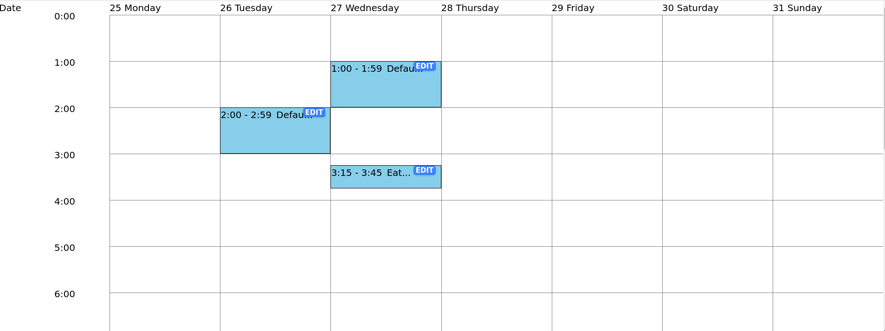
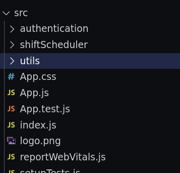
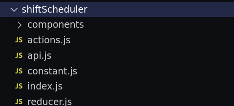

# Staffany frontend

## Requirements
- Build a web app that allows users to create shifts within a specific time range.
- Users are able to see a list of shifts for , and they can update, delete their shifts.
Additional:
    - User can resize a shift
    - User can drag the shift down and upward to update the time range of the shift



## Notes
- The implementation is heavily inspired by google calendar
- I'm not too familiar with typescript so I decided to go with plain javascript on this project but I can pick up typescript quickly if the job requires.

## Bugs are not resolved
- After dragging, resizing a shift and reload the pages, the shift doesn't appear correctly (I'm investigating on this, :'())
- Clicking on cells may generate duplicate shifts. 


## Behavior
- Whenever a user clicks on a cell. A shift with an expand of one hour will be automatically created.
- Users can resize the shift and drag the shift around to get the wanted time expansion.
## Project structures

- I group files by features.
- Why: It's easier to navigate around the project for team members in a large project. It's easier to develop and maintain. A new person joins in the team can quickly understand a specific feature without digging through the whole codebase.
- In this project. I have one feature for `shift management` and  one for `authentication`. Check out how to structure react projects here https://reactjs.org/docs/faq-structure.html
- Inside a feature folder
  
  

    - There are `api`, `actions`, `reducers`..., all the things needed for a project.
    - Feature folders doesn't include files of each other. 


## Library and tools used
- I use `create-react-app` to bootstrap a react project
- CSS: `Tailwind`. It's very productive to prototype a web application with good UI without using css directly.
- [ReactRnd](https://github.com/bokuweb/react-rnd): Create elements that can be resized and dragged 
- [DayJS](https://github.com/bokuweb/react-rnd): date time manipulation
- [ImmerJS](https://github.com/immerjs/immer): It's very painful to work with state because we have to make a copy of the whole state whenever we do some kind of updates. ImmerJS allows us to be productive by helping creating a clone of the state just by directly manipulating the it.


## How to run the project
- To start the development environment
```
$ npm run start
```
- Build for deployments
```
$ npm run build
```
